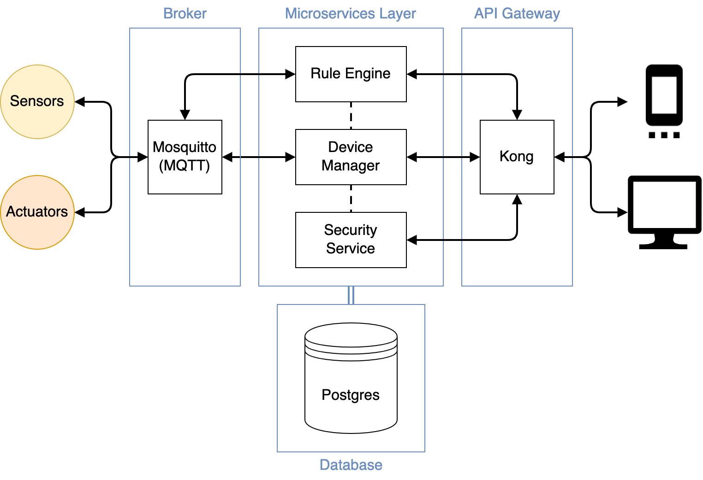

# HAUTO - Home Automation System

Hauto is a simple home automation system.

## Architecture

HAUTO application core is composed by 4 components:

- **Broker** - The message broker is responsible for receiving and delivering messages between devices and microservices. In our case the plan is to use the open-source MQTT broker Mosquitto.

- **API Gateway** - The API Gateway exposes the system's functionality to external applications. It receives requests via HTTP from the outside world and routes them to the appropriate microservice. The plan is to use the Kong API Gateway.

- **Microservices** - This layer consists of multiple microservices that handle different functionalities like authentication, device management, rules engine, and more. They can communicate with the Broker via the MQTT, or with the API Gateway via HTTP.
  The microservices are not restricted with implementation details.

- **Database** - The system's database. It stores the devices states, the user data, the existing rules, etc.