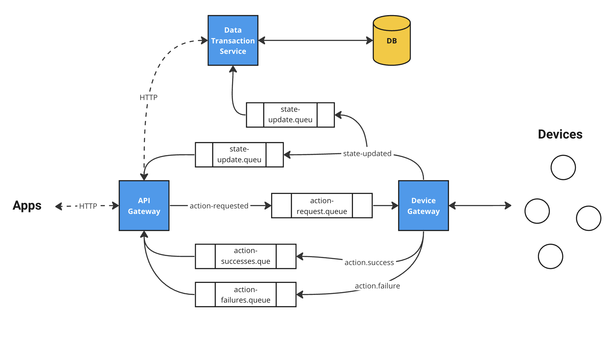
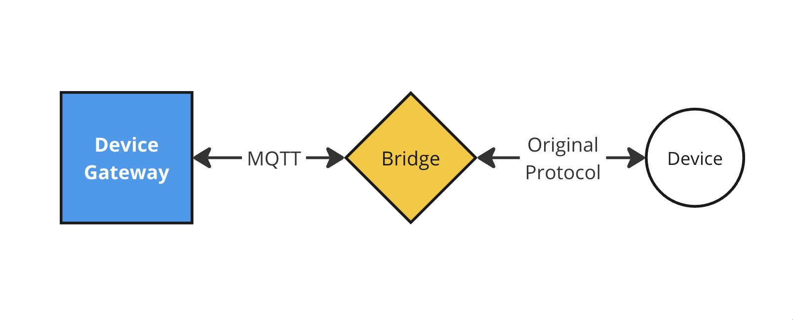

# HAUTO - Home Automation System

Hauto is a simple home automation system.

## Installation
> [!IMPORTANT]
> To install HAUTO, you must first have [Docker](https://www.docker.com/get-started/) installed.

### 1. Clone the repository
```shell
git clone https://github.com/pmoura-dev/hauto
```

### 2. Run
Inside the downloaded folder, use `docker-compose` to start the system:
```shell
docker-compose up -d
```

## Usage

By default, the application will expose a HTTP API on port 8000.

For example, we can fetch the list of devices existent in our system by making the following request:
```
curl http://localhost:8000/devices
```

> [!NOTE]
> You can check the full API documentation on ```http://localhost:8000/docs```

## Architecture

### Core



HAUTO application core is composed currently by 4 components:

- **RabbitMQ** - A message broker that also acts as a MQTT broker. Responsible for delivering messages between services, and also communicate with the IOT devices.
- **API Gateway** - The API Gateway exposes the system's functionality to external applications. It receives requests via HTTP from the outside world and routes them to the appropriate microservices.
- **TimescaleDB** - The systems's database.
- **Microservices** - The multiple microservices that handle the different functionalities of the system.

### Bridges

HAUTO bridges are small services that are used for providing MQTT communication to devices that don't have it originally.


